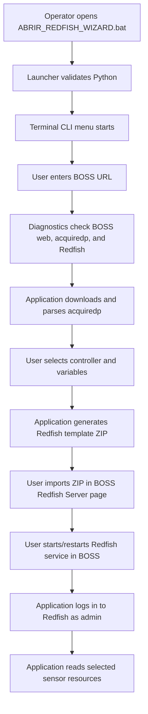
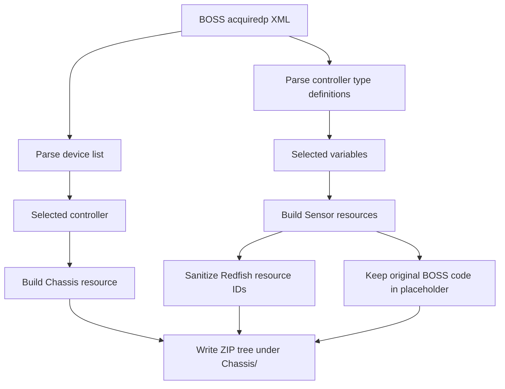
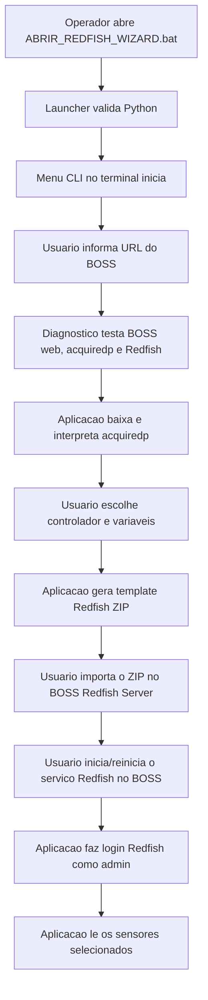
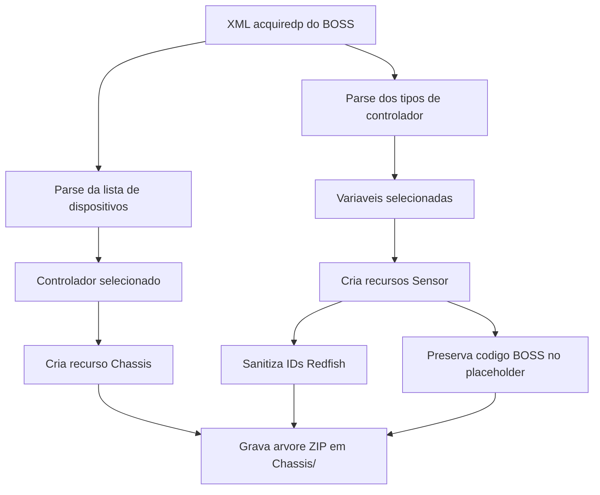

# BOSS Redfish Wizard

## English

### What This Project Does

BOSS Redfish Wizard is a Python CLI tool for CAREL BOSS supervisors. It helps an operator diagnose the BOSS Redfish service, inspect the BOSS `acquiredp` XML, select controllers and variables, generate Redfish template ZIP files, and read values exposed through the BOSS Redfish API.

The project is intentionally lightweight. It uses only the Python standard library, so it can run on Windows and Linux without a dependency installation step in most environments.

### What Is CAREL BOSS?

CAREL BOSS is a supervisory system used to monitor and operate HVAC/R installations. In a typical site, BOSS communicates with field controllers, collects values such as temperatures, pressures, compressor states, alarms, and setpoints, and exposes this information through the BOSS web interface.

In this project, BOSS is treated as the integration point. The application does not talk directly to each field controller. It reads the controller and variable map from BOSS, generates a Redfish template, and then reads the values that BOSS publishes through Redfish.

### What Is Redfish?

Redfish is a REST/JSON API standard. In practical terms, it exposes equipment data as structured web resources, usually under paths such as:

```text
/redfish
/redfish/v1/
/redfish/v1/Chassis
/redfish/v1/Chassis/{ChassisId}/Sensors
```

On BOSS, the Redfish service can publish selected controller values as Redfish resources. The application generates the template that tells BOSS which devices and variables should appear under the Redfish API.

### Why Use Redfish With BOSS?

Redfish is useful because it gives external software a cleaner and more stable interface than screen scraping or manual web UI inspection.

Main advantages:

- Standard HTTP/JSON integration model.
- Token-based authenticated API access.
- Clear resource structure for devices and sensors.
- Reusable templates for different controllers and variable selections.
- Easier integration with monitoring tools, data collectors, and automation scripts.
- Less dependence on manual BOSS web navigation after the Redfish template is configured.

### Project Structure

```text
.
|-- ABRIR_REDFISH_WIZARD.bat
|-- boss_redfish_wizard.py
|-- boss_redfish_cli.py
|-- boss_redfish/
|   |-- acquiredp.py
|   |-- cli_core.py
|   |-- client.py
|   |-- discovery.py
|   |-- template.py
|   |-- web_import.py
|   |-- wizard.py
|   `-- __init__.py
|-- deprecated/
|   `-- gui_app.py
|-- tests/
|   |-- fixtures/acquiredp.xml
|   |-- test_acquiredp_template.py
|   |-- test_cli_core.py
|   |-- test_template_client.py
|   `-- test_web_import.py
|-- README.md
|-- .gitignore
`-- .gitattributes
```

Generated template ZIP files are written to `dist/`. The `dist/` folder is ignored by Git.

### Scripts And Modules

| File | Purpose |
| --- | --- |
| `ABRIR_REDFISH_WIZARD.bat` | Windows CLI launcher. Checks Python, optionally installs Python through `winget`, and opens a terminal menu for wizard, diagnostics, readings, and polling. |
| `boss_redfish_wizard.py` | Small Python entrypoint that launches the CLI wizard. |
| `boss_redfish_cli.py` | Command-line interface for diagnostics, template generation, and sensor readings. |
| `boss_redfish/acquiredp.py` | Parses the BOSS `acquiredp` XML into controllers, types, groups, and variables. Also provides filtering helpers. |
| `boss_redfish/cli_core.py` | CLI-independent helpers for polling, template preview, and readings. Covered by tests. |
| `boss_redfish/discovery.py` | Normalizes BOSS URLs and probes BOSS web, `acquiredp`, Redfish root, and protected Redfish resources. |
| `boss_redfish/template.py` | Builds Redfish JSON resources and writes the template ZIP. Sanitizes IDs and preserves original BOSS variable codes in placeholders. |
| `boss_redfish/client.py` | Handles Redfish session login and sensor reads. |
| `boss_redfish/wizard.py` | Terminal-guided workflow for controller/variable selection, template generation, and reading. |
| `boss_redfish/web_import.py` | Manual import instructions for the BOSS Redfish Server page. |
| `tests/` | Automated tests for parser, template generation, client behavior, CLI helpers, and import. |

### General Logic



### Template Generation Logic



Example placeholder:

```text
{{'id':'9.007|TpAmbiente|VALUE'}}
```

The Redfish resource ID is sanitized for URLs, but the original BOSS code stays inside the placeholder so BOSS can resolve the value.

### Windows Launcher Behavior

`ABRIR_REDFISH_WIZARD.bat` is the recommended Windows entrypoint for the terminal CLI flow.

It checks for Python in this order:

1. `BOSS_REDFISH_PYTHON` environment variable.
2. `.venv\Scripts\python.exe` inside the project.
3. Common Python 3.12 install paths.
4. `py -3`.
5. `python`.
6. `python3`.

It validates:

- Python 3.10 or newer.
- Standard modules used by the application.
- Import of `boss_redfish_cli`.

If no valid Python is found, it tries:

```text
winget install --id Python.Python.3.12 -e --source winget
```

This automatic install requires `winget`, internet access, and permission from Windows/company policy.

### Launcher Screens

Successful startup:

```text
BOSS Redfish Wizard
====================

[OK] Python and basic dependencies found.
[OK] Starting command line interface.
```

Python not found:

```text
BOSS Redfish Wizard
====================

Python with tkinter was not found.
Installing Python 3.12 through winget...
A Windows permission prompt may appear.
```

`winget` not available:

```text
[ERROR] Automatic installation requires winget, but winget was not found.
Install Python 3.12 or newer manually from https://www.python.org/downloads/windows/
Select "Add python.exe to PATH" during installation.
```

Application files missing or broken:

```text
[ERROR] Python was found, but the CLI application could not be loaded.
Check that this folder is complete and that boss_redfish_cli.py exists.
```

CLI menu:

```text
Select an option:
  1 - Guided wizard
  2 - Diagnose BOSS / Redfish
  3 - Read sensor once or with polling
  4 - CLI help
  5 - Exit
```

### BOSS URL vs Redfish URL

- **BOSS URL**: `http(s)://IP/boss/` — used for diagnostics and downloading the `acquiredp` XML.
- **Redfish URL**: `https://IP` — used for sensor readings. No `/boss/` suffix.

If you type just the IP (for example `192.168.0.133`), the application normalizes it automatically.

### Chassis ID And Sensor ID

- **Chassis ID**: Generated from the controller name. Example: `CPCO_7_Eco2Pack_L3_Master_Cam_Congelados`.
- **Sensor ID**: The Redfish resource ID shown in the template preview. Example: `Temp_ambiente_TpAmbiente`.
- **Sensor ID is NOT the list index number**. Always use the ID Redfish string, not the number shown in the list.

The Redfish username is always `admin`. Do not use the BOSS web username for Redfish queries.

### TLS And Security

BOSS devices typically use self-signed TLS certificates. By default, the application skips TLS certificate verification to avoid connection errors. Use `--secure` to enable strict TLS verification if your environment has proper certificates.

### Run On Windows

Double-click:

```text
ABRIR_REDFISH_WIZARD.bat
```

Or run from PowerShell:

```powershell
cd C:\path\to\redfish
.\ABRIR_REDFISH_WIZARD.bat
```

If your environment already has a standard Python installation:

```powershell
$env:BOSS_REDFISH_PYTHON = "C:\Python312\python.exe"
.\ABRIR_REDFISH_WIZARD.bat
```

### Run On Linux

Linux does not use the `.bat` launcher. Install Python 3, then run the CLI directly:

```bash
python3 boss_redfish_cli.py wizard --boss http://BOSS_IP/boss/
```

### CLI Usage

Diagnose BOSS:

```powershell
python boss_redfish_cli.py diagnose --boss http://BOSS_IP/boss/
```

Generate a template from an `acquiredp` XML:

```powershell
python boss_redfish_cli.py template-from-selection --acquiredp tests\fixtures\acquiredp.xml --device-code 9.007 --variable TpAmbiente --output dist\temperature_address_7.zip
```

Read a published sensor:

```powershell
python boss_redfish_cli.py read --boss https://BOSS_IP --user admin --chassis-id CHASSIS_NAME --sensor SENSOR_ID
```

Poll a published sensor every 500 ms until stopped with `Ctrl+C`:

```powershell
python boss_redfish_cli.py read --boss https://BOSS_IP --user admin --chassis-id CHASSIS_NAME --sensor SENSOR_ID --watch --polling-ms 500
```

Poll a sensor a fixed number of times, useful for tests or quick checks:

```powershell
python boss_redfish_cli.py read --boss https://BOSS_IP --user admin --chassis-id CHASSIS_NAME --sensor SENSOR_ID --watch --polling-ms 500 --count 10
```

`--polling-ms` uses milliseconds. The application accepts 250 ms or higher, but 500 ms or higher is recommended to avoid unnecessary load on BOSS.

### Operational Flow

1. Enable and configure `Data Transfer > Redfish Server` in BOSS.
2. Set the Redfish `admin` password in BOSS.
3. Start the Redfish service.
4. Open the wizard.
5. Run diagnostics.
6. Load controllers from `acquiredp`.
7. Select the controller and variables.
8. Generate the template ZIP.
9. Import the ZIP in BOSS.
10. Click `Start` again in the BOSS Redfish page.
11. Read the values in the wizard.

### Local Validation

```powershell
python -m unittest discover -s tests -p "test*.py" -v
```

### Security And Limitations

- Passwords are not saved to files.
- Generated templates are ignored by Git through `dist/`.
- The test XML is synthetic and does not contain a real installation map.
- Template import is manual. The app generates the ZIP and shows the import steps.
- Ping alone is not enough to validate BOSS connectivity. The diagnostics check HTTP/HTTPS endpoints directly.
- A `401` response from `/redfish/v1/Chassis` without a token is expected and means the protected Redfish route exists.
- `WRONG_PLACEHOLDER` usually means the selected BOSS variable is not logged/historicized.
- `Invalid value for property 'ReadingType'` usually means an old template was generated with an invalid type for a boolean variable. Generate the template again with the current version.

---

## Portugues

### O Que Este Projeto Faz

BOSS Redfish Wizard e uma aplicacao Python em CLI para supervisores CAREL BOSS. Ela ajuda o operador a diagnosticar o servico Redfish do BOSS, inspecionar o XML `acquiredp`, escolher controladores e variaveis, gerar templates Redfish em `.zip` e ler valores publicados pela API Redfish.

O projeto foi mantido leve de proposito. Ele usa apenas a biblioteca padrao do Python, entao normalmente roda em Windows e Linux sem uma etapa de instalacao de dependencias externas.

### O Que E CAREL BOSS?

CAREL BOSS e um sistema supervisorio usado para monitorar e operar instalacoes de HVAC/R. Em uma instalacao tipica, o BOSS se comunica com controladores de campo, coleta valores como temperaturas, pressoes, estados de compressor, alarmes e setpoints, e disponibiliza essas informacoes pela interface web do BOSS.

Neste projeto, o BOSS e tratado como ponto de integracao. A aplicacao nao conversa diretamente com cada controlador de campo. Ela le o mapa de controladores e variaveis pelo BOSS, gera um template Redfish e depois le os valores que o BOSS publica pelo Redfish.

### O Que E Redfish?

Redfish e um padrao de API REST/JSON. Na pratica, ele expoe dados de equipamentos como recursos web estruturados, normalmente em caminhos como:

```text
/redfish
/redfish/v1/
/redfish/v1/Chassis
/redfish/v1/Chassis/{ChassisId}/Sensors
```

No BOSS, o servico Redfish pode publicar valores selecionados dos controladores como recursos Redfish. A aplicacao gera o template que informa ao BOSS quais dispositivos e variaveis devem aparecer na API Redfish.

### Por Que Usar Redfish Com BOSS?

Redfish vale a pena porque entrega uma interface mais limpa e estavel para softwares externos do que leitura manual da tela ou automacoes frageis sobre a interface web.

Principais vantagens:

- Integracao padrao via HTTP/JSON.
- Acesso autenticado por token.
- Estrutura clara de recursos para dispositivos e sensores.
- Templates reutilizaveis para diferentes controladores e selecoes de variaveis.
- Integracao mais simples com monitoramento, coleta de dados e automacoes.
- Menos dependencia de navegacao manual no BOSS depois que o template Redfish esta configurado.

### Estrutura Do Projeto

```text
.
|-- ABRIR_REDFISH_WIZARD.bat
|-- boss_redfish_wizard.py
|-- boss_redfish_cli.py
|-- boss_redfish/
|   |-- acquiredp.py
|   |-- cli_core.py
|   |-- client.py
|   |-- discovery.py
|   |-- template.py
|   |-- web_import.py
|   |-- wizard.py
|   `-- __init__.py
|-- deprecated/
|   `-- gui_app.py
|-- tests/
|   |-- fixtures/acquiredp.xml
|   |-- test_acquiredp_template.py
|   |-- test_cli_core.py
|   |-- test_template_client.py
|   `-- test_web_import.py
|-- README.md
|-- .gitignore
|-- .gitattributes
```

Templates `.zip` gerados ficam em `dist/`. A pasta `dist/` e ignorada pelo Git.

### Scripts E Modulos

| Arquivo | Objetivo |
| --- | --- |
| `ABRIR_REDFISH_WIZARD.bat` | Launcher CLI para Windows. Verifica Python, tenta instalar Python via `winget` se necessario e abre um menu de terminal para wizard, diagnostico, leitura e polling. |
| `boss_redfish_wizard.py` | Pequeno entrypoint Python que inicia o assistente em CLI. |
| `boss_redfish_cli.py` | Interface de linha de comando para diagnostico, geracao de template e leitura. |
| `boss_redfish/acquiredp.py` | Faz o parse do XML `acquiredp` em controladores, tipos, grupos e variaveis. Tambem fornece filtros. |
| `boss_redfish/cli_core.py` | Funcoes independentes de CLI usadas pela aplicacao e cobertas por testes. |
| `boss_redfish/discovery.py` | Normaliza URLs do BOSS e testa BOSS web, `acquiredp`, raiz Redfish e recursos protegidos. |
| `boss_redfish/template.py` | Gera os recursos JSON Redfish e grava o ZIP. Sanitiza IDs e preserva codigos BOSS nos placeholders. |
| `boss_redfish/client.py` | Faz login de sessao Redfish e leitura de sensores. |
| `boss_redfish/wizard.py` | Fluxo guiado no terminal para controlador/variaveis e geracao de template. |
| `boss_redfish/web_import.py` | Instrucoes de importacao manual para a pagina do Redfish Server no BOSS. |
| `tests/` | Testes automatizados do parser, template, cliente, helpers de CLI e importacao. |

### Esquematico Geral Da Logica



### Logica De Geracao Do Template



Exemplo de placeholder:

```text
{{'id':'9.007|TpAmbiente|VALUE'}}
```

O ID Redfish e sanitizado para URL, mas o codigo original do BOSS permanece dentro do placeholder para que o BOSS consiga resolver o valor.

### Comportamento Do Launcher Windows

`ABRIR_REDFISH_WIZARD.bat` e o ponto de entrada recomendado no Windows para o fluxo CLI em terminal.

Ele procura Python nesta ordem:

1. Variavel de ambiente `BOSS_REDFISH_PYTHON`.
2. `.venv\Scripts\python.exe` dentro do projeto.
3. Caminhos comuns de instalacao do Python 3.12.
4. `py -3`.
5. `python`.
6. `python3`.

Ele valida:

- Python 3.10 ou superior.
- Modulos padrao usados pela aplicacao.
- Importacao de `boss_redfish_cli`.

Se nenhum Python valido for encontrado, ele tenta:

```text
winget install --id Python.Python.3.12 -e --source winget
```

Essa instalacao automatica depende de `winget`, internet e permissao do Windows/politica da empresa.

### Telas Do .bat

Inicializacao com sucesso:

```text
BOSS Redfish Wizard
====================

[OK] Python and basic dependencies found.
[OK] Starting command line interface.
```

Python nao encontrado:

```text
BOSS Redfish Wizard
====================

Python with tkinter was not found.
Installing Python 3.12 through winget...
A Windows permission prompt may appear.
```

`winget` indisponivel:

```text
[ERROR] Automatic installation requires winget, but winget was not found.
Install Python 3.12 or newer manually from https://www.python.org/downloads/windows/
Select "Add python.exe to PATH" during installation.
```

Arquivos da aplicacao ausentes ou quebrados:

```text
[ERROR] Python was found, but the CLI application could not be loaded.
Check that this folder is complete and that boss_redfish_cli.py exists.
```

Menu CLI:

```text
Select an option:
  1 - Guided wizard
  2 - Diagnose BOSS / Redfish
  3 - Read sensor once or with polling
  4 - CLI help
  5 - Exit
```

### URL do BOSS vs URL Redfish

- **URL do BOSS**: `http(s)://IP/boss/` — usada para diagnosticos e download do XML `acquiredp`.
- **URL Redfish**: `https://IP` — usada para leitura de sensores. Nao deve conter o sufixo `/boss/`.

Se voce digitar apenas o IP (ex: `192.168.0.133`), a aplicacao faz a normalizacao automaticamente.

### Chassis ID e Sensor ID

- **Chassis ID**: Gerado a partir do nome do controlador. Exemplo: `CPCO_7_Eco2Pack_L3_Master_Cam_Congelados`.
- **Sensor ID**: O ID do recurso Redfish exibido no preview do template. Exemplo: `Temp_ambiente_TpAmbiente`.
- **O Sensor ID NAO e o numero de indice da lista**. Use sempre a string do ID Redfish, nao o numero correspondente.

O usuario do Redfish e sempre `admin`. Nao utilize o usuario web do BOSS para consultas Redfish.

### TLS e Seguranca

Dispositivos BOSS normalmente utilizam certificados TLS autoassinados. Por padrao, a aplicacao ignora a verificacao do certificado TLS para evitar erros de conexao. Use o argumento `--secure` caso queira impor a validacao estrita do certificado TLS.

### Rodar No Windows

De dois cliques em:

```text
ABRIR_REDFISH_WIZARD.bat
```

Ou execute pelo PowerShell:

```powershell
cd C:\caminho\para\redfish
.\ABRIR_REDFISH_WIZARD.bat
```

Se a empresa ja tiver um Python padronizado:

```powershell
$env:BOSS_REDFISH_PYTHON = "C:\Python312\python.exe"
.\ABRIR_REDFISH_WIZARD.bat
```

### Rodar No Linux

Linux nao usa o launcher `.bat`. Instale Python 3 e execute o CLI diretamente:

```bash
python3 boss_redfish_cli.py wizard --boss http://BOSS_IP/boss/
```

### Uso Via CLI

Diagnosticar o BOSS:

```powershell
python boss_redfish_cli.py diagnose --boss http://BOSS_IP/boss/
```

Gerar template a partir de um XML `acquiredp`:

```powershell
python boss_redfish_cli.py template-from-selection --acquiredp tests\fixtures\acquiredp.xml --device-code 9.007 --variable TpAmbiente --output dist\temperatura_endereco_7.zip
```

Ler um sensor publicado:

```powershell
python boss_redfish_cli.py read --boss https://BOSS_IP --user admin --chassis-id NOME_DO_CHASSIS --sensor ID_DO_SENSOR
```

Fazer polling de um sensor publicado a cada 500 ms ate parar com `Ctrl+C`:

```powershell
python boss_redfish_cli.py read --boss https://BOSS_IP --user admin --chassis-id NOME_DO_CHASSIS --sensor ID_DO_SENSOR --watch --polling-ms 500
```

Fazer polling por uma quantidade fixa de ciclos, util para testes rapidos:

```powershell
python boss_redfish_cli.py read --boss https://BOSS_IP --user admin --chassis-id NOME_DO_CHASSIS --sensor ID_DO_SENSOR --watch --polling-ms 500 --count 10
```

`--polling-ms` usa milissegundos. A aplicacao aceita 250 ms ou mais, mas 500 ms ou mais e recomendado para evitar carga desnecessaria no BOSS.

### Fluxo Operacional

1. Habilite e configure `Data Transfer > Redfish Server` no BOSS.
2. Defina a senha Redfish do usuario `admin` no BOSS.
3. Inicie o servico Redfish.
4. Abra o wizard.
5. Rode o diagnostico.
6. Carregue os controladores pelo `acquiredp`.
7. Escolha o controlador e as variaveis.
8. Gere o template `.zip`.
9. Importe o ZIP no BOSS.
10. Clique em `Start` novamente na pagina Redfish do BOSS.
11. Leia os valores no wizard ou CLI.

### Validacao Local

```powershell
python -m unittest discover -s tests -p "test*.py" -v
```

### Seguranca E Limitacoes

- Senhas nao sao salvas em arquivo.
- Templates gerados sao ignorados pelo Git por meio da pasta `dist/`.
- O XML de teste e sintetico e nao contem mapa real de instalacao.
- A importacao do template e manual. O app gera o ZIP e mostra os passos de importacao.
- Ping sozinho nao valida conectividade com o BOSS. O diagnostico testa endpoints HTTP/HTTPS diretamente.
- Uma resposta `401` em `/redfish/v1/Chassis` sem token e esperada e indica que a rota protegida Redfish existe.
- `WRONG_PLACEHOLDER` normalmente indica que a variavel selecionada nao esta logada/historicizada no BOSS.
- `Invalid value for property 'ReadingType'` normalmente indica um template antigo gerado com tipo invalido para variavel booleana. Gere o template novamente com a versao atual.
